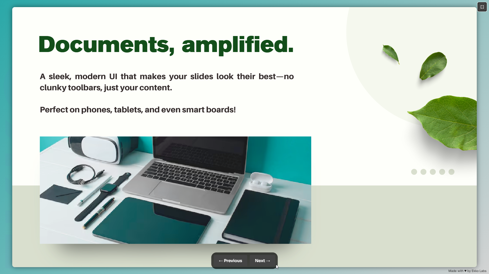

<div align="center">
    
</div>

**Demo presentation is available here:** [Why Ekko?](https://ekko.naghi.me/ekko) ← _Try the swipe gestures!_



## Why ekko?

_Less config. More presenting._ ✨

- **Professional Presentations** - A sleek, modern UI that makes your slides look their best—no clunky toolbars, just your content.
- **Easy Sharing** - Custom/short URLs to distribute presentations effortlessly.
- **Works Everywhere** - Perfect on phones, tablets, and even smart boards!
- **Keyboard Shortcuts**
  - `← →` Navigate slides
  - `F` Toggle fullscreen
  - `Esc` Exit fullscreen
- **Touch Friendly** - Intuitive swipe controls that just _work_.
- **Fully Customizable** - Tweak colors, disable animations, and make it your own.
- **Lightweight** - Built with vanilla JS and PDF.js—no bloated frameworks. Under 500KB, optimized for slow connections.
- **Zero Hassle** - No dependency hell. Just download, swap your URL, and deploy.

## Getting started

_From zero to slideshow in 3... 2... 1..._ 🚀

1. Clone the repo:

   ```bash
   git clone https://github.com/naghim/ekko.git && cd ekko
   ```

2. Replace the default URL in `index.html` with your slideshow folder.

3. Deploy to your server or host on GitHub Pages. Done!

## Roadmap

_Spoiler alert: It gets even better._ 🛠️

Ekko is a battle-tested MVP, but there’s more to come:

- Pinch-to-zoom for mobile
- Drag-and-drop uploads for presentations
- Presenter notes support
